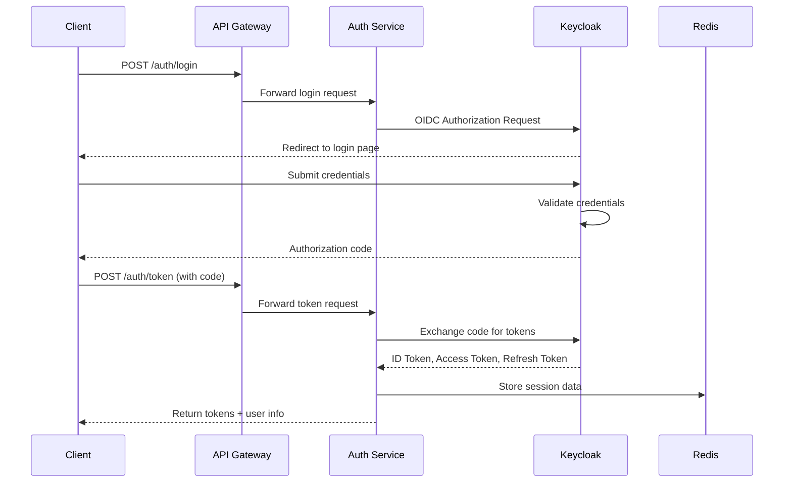
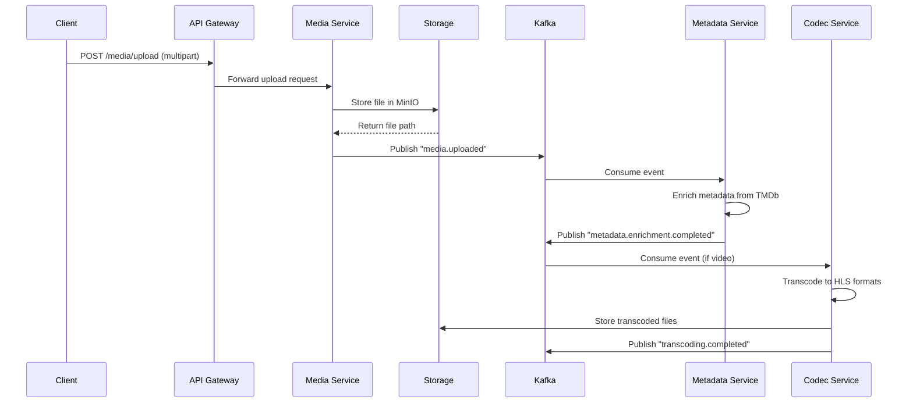
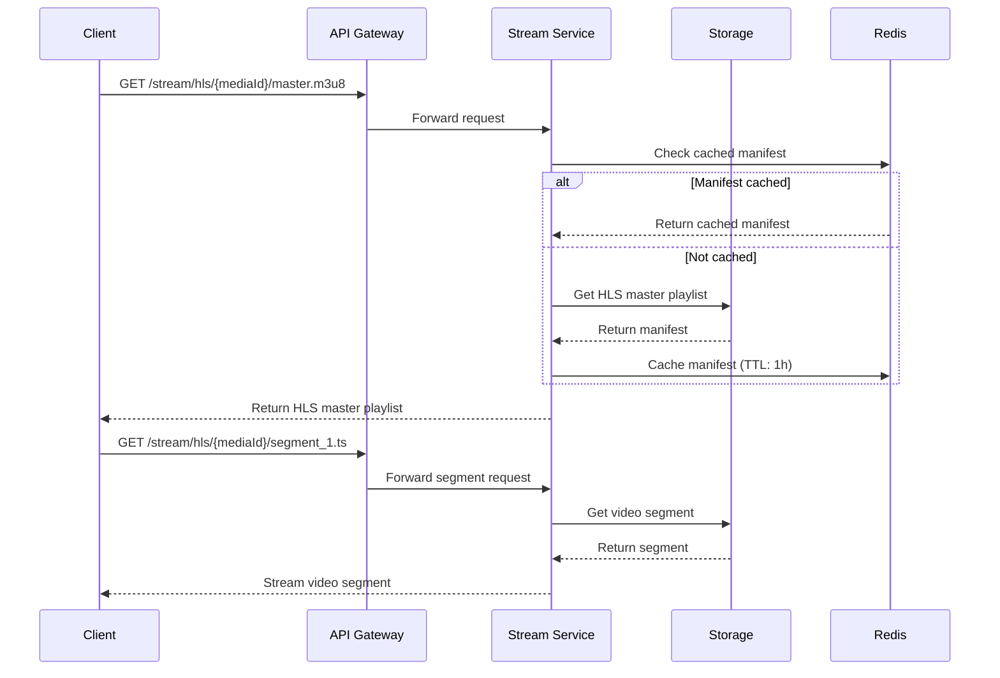

# Техническое описание медиа-платформа GreenLamp Hub

## 1. Описание проекта

**GreenLamp Hub** — это self-hosted медиа-платформа для организации персональных медиатек с возможностью стриминга контента на различные устройства. 
Платформа построена на микросервисной архитектуре с использованием .NET и обеспечивает безопасное хранение, каталогизацию и воспроизведение медиафайлов.

**Основные возможности:**

- Загрузка и управление видео, аудио, изображениями
- Автоматическое обогащение метаданных из внешних источников ([TMDb/OMDb](https://www.themoviedb.org/))
- Стриминг с адаптивным битрейтом (HLS)
- Мультиклиентская поддержка (веб, мобильные, ТВ)
- Ролевое управление доступом

## 2. Основные задачи

### Бизнес-задачи:

- Создание персональной медиатеки для домашнего использования
- Совместный доступ к контенту для семьи/друзей
- Кроссплатформенный доступ к медиатеке
- Автоматизация управления метаданными

### Технические задачи:

- Разработка отказоустойчивой микросервисной архитектуры
- Реализация безопасной аутентификации и авторизации
- Обеспечение производительного стриминга больших файлов
- Создание системы обработки и конвертации медиа
- Реализация полнотекстового поиска

### Технические требования:

- Платформа реализована как набор микросервисов на .NET 8/10 (LTS), 
- Использует Apache Kafka для асинхронной коммуникации, 
- Комбинирует REST/gRPC для синхронных вызовов, 
- PostgreSQL для транзакционных данных,
- Redis для кеширования и сессий, 
- S3-совместимое хранилище (MinIO) для медиафайлов.
- Аутентификация и авторизация реализованы через OIDC (Keycloak). 

---

## 3. Роли пользователей и бизнес-процессы

### Роли

| Роль                | Описание                        | Permissions                                                     |
| ------------------- | ------------------------------- | --------------------------------------------------------------- |
| **Guest**           | Неавторизованный пользователь   | Просмотр публичного контента                                    |
| **User**            | Зарегистрированный пользователь | Загрузка контента, создание библиотек, просмотр своего контента |
| **Administrator**   | Администратор системы           | Управление пользователями, глобальные настройки, мониторинг     |
### Сценарии взаимодействия

#### Регистрация и аутентификация

1. Клиент → API Gateway: POST /auth/login
2. API Gateway → Auth Service: POST /auth/login
3. Auth Service → Keycloak: OIDC Token Request
4. Keycloak → Auth Service: JWT Tokens
5. Auth Service → Redis: Cache session (TTL: 30 min)
6. Auth Service → Клиент: JWT Access + Refresh tokens



#### Загрузка медиафайла

1. Клиент → API Gateway: POST /media/upload (with JWT)
2. API Gateway → Auth Service: Validate JWT
3. API Gateway → Media Service: Upload request
4. Media Service → MinIO: Upload file to S3
5. Media Service → PostgreSQL: Save metadata
6. Media Service → Kafka: Publish "media.uploaded"
7. Metadata Service ← Kafka: Consume "media.uploaded"
8. Metadata Service → FFmpeg: Extract metadata
9. Metadata Service → PostgreSQL: Save extended metadata
10. Metadata Service → Kafka: Publish "metadata.extracted"


#### Стриминг видео

1. Клиент → API Gateway: GET /media/{id}/stream (with JWT)
2. API Gateway → Auth Service: Validate JWT
3. API Gateway → Streaming Service: Stream request
4. Streaming Service → PostgreSQL: Get media info
5. Streaming Service → Redis: Check cache (TTL: 1 hour)
6. Streaming Service → MinIO: Get file/segments
7. Streaming Service → Клиент: HLS playlist/segments



## 4. Микросервисы

### 1. Auth Service

**Ответственность:** Управление пользователями, аутентификация, авторизация

**Технологии:**
- .NET 8 
- [Keycloak Integration](https://juliocasal.com/blog/keycloak-tutorial-for-net-developers)
- PostgreSQL (пользовательские данные)
- Redis (сессии)

**API Endpoints:**
```csharp
// REST API
POST /api/auth/login          // OIDC flow initiation
POST /api/auth/refresh        // Token refresh
GET  /api/users/profile       // User profile
POST /api/users/register      // User registration (admin)

// gRPC Service
service UserService {
    rpc ValidateToken (TokenRequest) returns (UserResponse);
    rpc GetUserPermissions (UserRequest) returns (PermissionsResponse);
}
```

**События Kafka:**

- `user.registered` - новый пользователь
- `user.updated` - обновление профиля
- `user.deleted` - удаление пользователя

**Модель данных:**
```sql
CREATE TABLE users (
    id UUID PRIMARY KEY,
    username VARCHAR(50) UNIQUE NOT NULL,
    email VARCHAR(255) UNIQUE NOT NULL,
    role VARCHAR(20) DEFAULT 'user',
    created_at TIMESTAMPTZ DEFAULT NOW(),
    is_active BOOLEAN DEFAULT true
);

CREATE INDEX idx_users_email ON users(email);
CREATE INDEX idx_users_username ON users(username);
```

### 2. Media Service

**Ответственность:** Управление медиафайлами, библиотеками, плейлистами

**Технологии:**

- .NET 8 (Minimal API)
- PostgreSQL (метаданные медиа)
- [MinIO/S3 (файлы)](https://www.min.io/)
- Redis (кеш библиотек)

**API Endpoints:**
```csharp
// Minimal API
POST /media/upload           // Загрузка файла
GET /media/{id}              // Получение метаданных
PUT /media/{id}              // Обновление метаданных
DELETE /media/{id}           // Удаление медиа
GET /libraries               // Список библиотек
POST /libraries              // Создание библиотеки
GET /playlists               // Плейлисты пользователя
```

**События Kafka:**

- `media.uploaded` - новый файл загружен
- `media.updated` - обновление метаданных
- `media.deleted` - удаление медиа

**Модель данных:**
```sql
CREATE TABLE media_files (
    id UUID PRIMARY KEY,
    user_id UUID REFERENCES users(id),
    title VARCHAR(500) NOT NULL,
    description TEXT,
    file_path VARCHAR(1000) NOT NULL,
    file_size BIGINT,
    duration INT, -- seconds
    media_type VARCHAR(20), -- video, audio, image
    format VARCHAR(10),
    created_at TIMESTAMPTZ DEFAULT NOW(),
    updated_at TIMESTAMPTZ DEFAULT NOW()
);

CREATE TABLE libraries (
    id UUID PRIMARY KEY,
    name VARCHAR(255) NOT NULL,
    description TEXT,
    owner_id UUID REFERENCES users(id),
    is_public BOOLEAN DEFAULT false,
    created_at TIMESTAMPTZ DEFAULT NOW()
);

CREATE INDEX idx_media_user ON media_files(user_id);
CREATE INDEX idx_media_type ON media_files(media_type);
```

### 3. Metadata Service

**Ответственность:** Обогащение метаданных из внешних источников

**Технологии:**

- .NET 8 (Worker Service)
- [TMDb/OMDb](https://www.themoviedb.org/) API
- PostgreSQL
- Redis (кеш внешних запросов)

**API Endpoints:**
```csharp
// gRPC Service
service MetadataService {
    rpc EnrichMetadata (MetadataRequest) returns (MetadataResponse);
    rpc SearchExternal (SearchRequest) returns (SearchResponse);
}

// REST API для админки
POST /metadata/enrich/{mediaId}
GET /metadata/providers

```

**События Kafka:**

- `metadata.enrichment.requested` - запрос на обогащение
- `metadata.enrichment.completed` - обогащение завершено
- `metadata.enrichment.failed` - ошибка обогащения

**Модель данных:**
```sql
CREATE TABLE media_metadata (
    id UUID PRIMARY KEY,
    media_id UUID REFERENCES media_files(id),
    external_id VARCHAR(100), -- ID из TMDb/OMDb
    title VARCHAR(500),
    overview TEXT,
    release_date DATE,
    genres VARCHAR(100)[],
    rating DECIMAL(3,1),
    poster_url VARCHAR(1000),
    backdrop_url VARCHAR(1000),
    cast JSONB,
    directors VARCHAR(100)[],
    created_at TIMESTAMPTZ DEFAULT NOW()
);

CREATE INDEX idx_metadata_media ON media_metadata(media_id);
CREATE INDEX idx_metadata_external ON media_metadata(external_id);
```

### 4. Stream Service

**Ответственность:** Стриминг медиафайлов, HLS генерация

**Технологии:**
- .NET 8 (ASP.NET Core)
- [FFmpeg(через Process API)](https://www.nuget.org/packages/FFMpegCore#readme-body-tab)
- [MinIO/S3](https://www.min.io/)
- Redis (кеш манифестов)

**API Endpoints:**
```csharp
// REST API для стриминга
GET /stream/hls/{mediaId}/master.m3u8
GET /stream/hls/{mediaId}/segment_{index}.ts
GET /stream/direct/{mediaId}          // Прямая загрузка
HEAD /stream/direct/{mediaId}         // Поддержка range requests

// gRPC для внутренней коммуникации
service StreamService {
    rpc GetStreamInfo (StreamRequest) returns (StreamInfo);
    rpc PrepareHLS (HlsRequest) returns (HlsResponse);
}
```

### 5. Search Service

**Ответственность:** Полнотекстовый поиск по медиатеке

**Технологии:**
- .NET 8 (Worker Service)
- [Elasticsearch](https://www.elastic.co/elasticsearch)
- PostgreSQL (primary storage)

**API Endpoints:**
```csharp
// REST API
GET /search?q={query}&type={mediaType}
GET /search/suggest?q={query}
POST /search/advanced          // Расширенный поиск

// gRPC для внутренней коммуникации
service SearchService {
    rpc IndexMedia (IndexRequest) returns (IndexResponse);
    rpc SearchMedia (SearchRequest) returns (SearchResponse);
}
```

**События Kafka:**
- `search.index.requested` - запрос на индексацию
- `search.index.completed` - индексация завершена

### 6. Codec Service

**Ответственность:** Транскодирование видео, управление качеством

**Технологии:**

- .NET 8 (Worker Service)
- [FFmpeg (нативный)](https://www.nuget.org/packages/FFMpegCore#readme-body-tab)
- Redis (очередь задач)
- [MinIO/S3](https://www.min.io/)

**События Kafka:**

- `transcoding.requested` - запрос на транскодирование
- `transcoding.progress` - прогресс обработки
- `transcoding.completed` - завершение транскодирования
- `transcoding.failed` - ошибка обработки